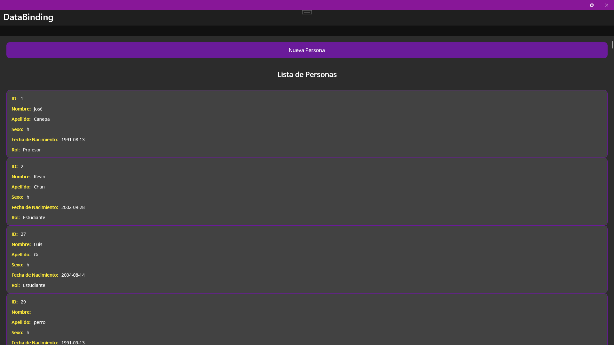
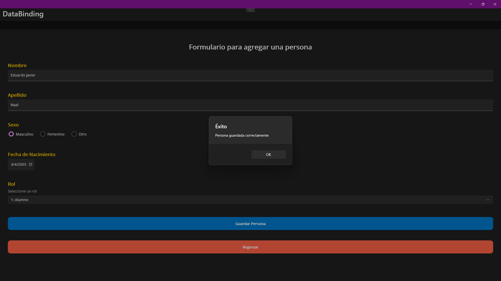
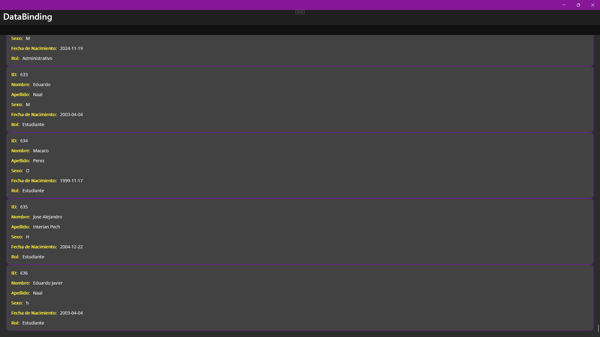

# Data-Binging Servisio-Escolar
## Descripción
Una aplicación MAUI multiplataforma, donde consumimos una API y mostraremos de manera visual las personas, al igual donde añadiremos a mas personas, usando las operaciónes POST y GET.

## Demostración
### Vista de la pagina principal
- Consultamos la API y se muestra la inforamcion de las personas que estan registradas.

### Formulario para añadir a una persona
- Registramos a la persona en los campos solicitados y lo guardamos, indicando un mensaje que se ha realizado exitosamente.
  
  ### Demostracion del guardado
  - Verificamos que la persona añadida si se refleje en la API y nos muestra su informacion
  
